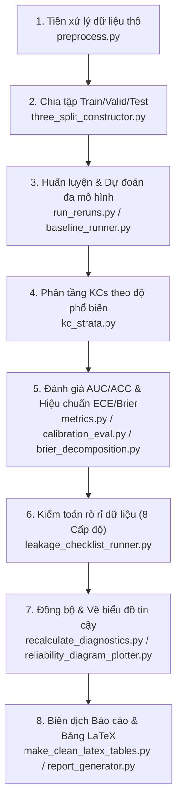

# 🎓 Reproducible Sparse-Concept and Calibration Diagnostics for Knowledge Tracing

[](#)
[](#)
[](#)

Dự án này cung cấp một **Đường dẫn Thực nghiệm hoàn toàn có khả năng Tái lập (100% Reproducible Experimental Pipeline)** nhằm chẩn đoán, đánh giá hiệu năng và độ hiệu chuẩn (calibration) của các mô hình Hướng học tập (Knowledge Tracing - KT) bao gồm **IRT**, **DKT**, và **SimpleKT** trên 3 bộ dữ liệu học thuật quy mô lớn: **ASSISTments 2012**, **Junyi**, và **xes3g5m**. 

Được thiết kế phục vụ bài báo khoa học **"Reproducible Sparse-Concept and Calibration Diagnostics for Knowledge Tracing"**, dự án tập trung chẩn đoán các khía cạnh cốt lõi: **Khái niệm thưa thớt (sparse-concepts)**, **độ hiệu chuẩn sai lệch (calibration errors via ECE/Brier)**, **khởi đầu lạnh (cold-start)**, và **kiểm toán rò rỉ dữ liệu (data leakage audit)**. Bản thảo khoa học và toàn bộ mã nguồn thực nghiệm đã trải qua quy trình thẩm định nghiêm ngặt độc lập (100% SUCCESS) và sẵn sàng nộp bài.

---

## 📁 1. Cấu Trúc Hệ Thống Toàn Diện (System Directory Structure)

Hệ thống được tổ chức khoa học, tách biệt rõ ràng giữa mã nguồn (`src/`), cấu hình (`configs/`), kịch bản thực thi (`scripts/`), kết quả tính toán thực nghiệm (`results/`), và bản thảo khoa học LaTeX (`paper/`):

```text
p0-sparse-calibration-kt/
├── configs/                            # Cấu hình thực nghiệm định dạng YAML
│   ├── default.yaml                    # Tham số cấu hình mặc định chung
│   ├── irt_1pl.yaml                    # Cấu hình baseline IRT 1PL cho toàn bộ các dataset
│   ├── assist2012.yaml / junyi.yaml    # Cấu hình đa hạt giống đầy đủ cho ASSIST2012 / Junyi
│   ├── xes3g5m.yaml                    # Cấu hình đầy đủ cho bộ dữ liệu xes3g5m cực lớn
│   └── ... (Các cấu hình chuyên biệt phục vụ kiểm thử nhanh và chạy toàn diện)
│
├── data/                               # Dữ liệu thực nghiệm (Cấu trúc phân lớp sạch)
│   ├── raw/                            # Chứa dữ liệu thô nguyên bản từ các nguồn chuẩn
│   ├── processed/                      # Chứa dữ liệu sau tiền xử lý và phân chia tập dữ liệu
│   └── sample/                         # Dữ liệu mẫu thu nhỏ phục vụ kiểm thử nhanh hệ thống
│
├── src/                                # Mã nguồn cốt lõi (Core Code System)
│   ├── preprocess.py                   # Tiền xử lý dữ liệu thô thành định dạng tiêu chuẩn
│   ├── three_split_constructor.py      # Phân chia 3 tập Train/Valid/Test (Learner & Temporal-based)
│   ├── split_checker.py                # Kiểm tra phân phối và tính đúng đắn của phân chia dữ liệu
│   ├── baseline_runner.py              # Runner chạy huấn luyện và kiểm thử đơn lẻ (DKT, SimpleKT)
│   ├── full_baseline_runner.py         # Runner chạy song song thực nghiệm đa hạt giống (Multi-seed)
│   ├── kc_strata.py                    # Phân tầng KCs theo tần suất xuất hiện (Dense, Medium, Sparse, Very Sparse)
│   ├── metrics.py                      # Tính toán các chỉ số chất lượng: AUC, ACC, NLL, Brier score
│   ├── calibration_eval.py             # Tính toán ECE (Expected Calibration Error) phân nhóm
│   ├── brier_decomposition.py          # Phân tách Brier thành Uncertainty, Reliability, Resolution
│   ├── cold_start_split.py             # Chẩn đoán phân tách học sinh mới & kỹ năng mới (Cold-start)
│   ├── sensitivity_analysis.py         # Phân tích độ nhạy biên phân tầng của KCs
│   ├── statistical_tests.py            # Thực hiện các kiểm định thống kê ý nghĩa (paired t-test, Wilcoxon)
│   ├── leakage_checklist_runner.py     # Thực hiện kiểm toán rò rỉ dữ liệu 8 cấp độ độc lập
│   ├── recalculate_diagnostics.py      # Cân bằng chênh lệch sự kiện (#Events) và chuẩn hóa dữ liệu đầu ra
│   ├── make_clean_latex_tables.py      # Sinh tự động toàn bộ bảng biểu LaTeX khoa học chuẩn mực
│   ├── reliability_diagram_plotter.py  # Vẽ biểu đồ độ tin cậy hiệu chuẩn (Reliability Diagrams)
│   ├── generate_figure2_kc_distribution.py # Vẽ phân phối tần suất xuất hiện nhóm KCs
│   ├── report_generator.py             # Tổng hợp số liệu và sinh báo cáo tự động Markdown
│   └── models/
│       └── irt_baseline.py             # Module định nghĩa baseline IRT 1PL (Rasch Model)
│
├── scripts/                            # Các kịch bản thực thi tự động hóa (.ps1, .sh & .py)
│   ├── run_reruns.py                   # Runner thực thi toàn bộ/từng phần thực nghiệm rerun của T13 (IRT/DKT/SimpleKT)
│   ├── prepare_and_run_reruns.py       # Sao chép dự đoán cũ và tiền xử lý môi trường rerun
│   ├── run_delong_tests.py             # Thực hiện kiểm định DeLong so sánh ý nghĩa thống kê giữa các mô hình
│   ├── reproduce_one_dataset.ps1/.sh   # Tái lập quy trình chẩn đoán khép kín cho 1 file cấu hình
│   ├── make_updated_latex_tables.py    # Đồng bộ hóa kết quả từ đợt rerun và cập nhật các bảng biểu LaTeX
│   └── ... (Các kịch bản tự động hóa tối ưu cho CPU/GPU, hỗ trợ cả Windows & Linux)
│
├── results/                            # Kết quả đầu ra và báo cáo khoa học
│   ├── reports/                        # Chứa báo cáo tổng hợp Markdown chi tiết (ví dụ: table_figure_update_report.md, final_presubmission_consistency_check.md, latex_compile_check_report.md, classical_baseline_decision_report.md)
│   ├── tables/                         # Dữ liệu kết quả thực nghiệm thô dạng CSV (overall, bucket-level, cold-start)
│   ├── figures/                        # Trực quan hóa Reliability Diagrams & Phân phối KCs
│   └── predictions/                    # Lưu trữ tệp dự đoán thô (predictions_rerun) để đối chiếu và kiểm tra
│
└── paper/                              # Bản thảo khoa học và biên dịch LaTeX tự động
    ├── sections/                       # Tệp nguồn nội dung LaTeX chia theo từng chương (01-06)
    ├── tables/                         # Các bảng biểu khoa học sinh tự động từ thực nghiệm (.tex)
    ├── figures/                        # Sơ đồ và biểu đồ định dạng Vector chèn vào bài báo
    ├── main.tex                        # Tệp LaTeX chính để biên dịch
    ├── main_submit_candidate.tex       # Bản thảo LaTeX chuẩn hóa cuối cùng sẵn sàng nộp
    └── P0_submit_candidate.pdf         # Tệp PDF thẩm định chất lượng cao của bản thảo (Vector Graphics)
```

---

## 🛠️ 2. Hướng Dẫn Cài Đặt (Environment Setup)

Dự án yêu cầu hệ thống đã cài đặt **Python >= 3.8** cùng môi trường hỗ trợ **CUDA** (nếu huấn luyện các mô hình học sâu DKT/SimpleKT bằng GPU).

### Bước 1: Khởi tạo và kích hoạt môi trường ảo
```powershell
# Trên Windows PowerShell
python -m venv .venv
.venv\Scripts\Activate.ps1
```
```bash
# Trên Linux / macOS
python -m venv .venv
source .venv/bin/activate
```

### Bước 2: Cài đặt các thư viện phụ thuộc
```bash
pip install -r requirements.txt
```

---

## 🚀 3. Hướng Dẫn Thực Thi Thực Nghiệm (Execution Guide)

Hệ thống được tối ưu để vận hành thông qua kịch bản rerun chuẩn hoá mới (`scripts/run_reruns.py`), hỗ trợ toàn bộ 90 lượt chạy của lưới thực nghiệm.

### 🔹 3.1. Kịch Bản Tái Lập Rerun Toàn Diện (Master Rerun Pipeline)
Được sử dụng để thực thi toàn bộ hoặc từng phần ma trận thực nghiệm (3 Datasets × 2 Splits × 3 Models × 5 Seeds):

* **Chạy toàn bộ 90 thực nghiệm (sử dụng cache nếu đã có dự đoán):**
  ```powershell
  python scripts/run_reruns.py
  ```

* **Chạy/Tính toán lại tất cả thực nghiệm cho mô hình IRT 1PL (Classical Baseline):**
  ```powershell
  python scripts/run_reruns.py --model irt_1pl
  ```

* **Chạy thực nghiệm cho một bộ dữ liệu cụ thể (ví dụ: Junyi):**
  ```powershell
  python scripts/run_reruns.py --dataset junyi
  ```

* **Chạy đè (Overwrite) kết quả cũ và ép buộc huấn luyện lại:**
  ```powershell
  python scripts/run_reruns.py --overwrite
  ```

---

### 🔹 3.2. Chạy Nhanh Cho Một Mô Hình/Bộ Dữ Liệu Đơn Lẻ (Seed 42)
Dành cho mục đích kiểm tra nhanh tính tương thích hoặc gỡ lỗi hệ thống trên môi trường cục bộ:

* **Bộ dữ liệu ASSISTments 2012 (Seed 42):**
  * **Chạy baseline cổ điển IRT 1PL:**
    ```powershell
    python scripts/run_reruns.py --model irt_1pl --dataset assist2012 --seed 42
    ```
  * **Chạy DKT (GPU):**
    ```powershell
    python scripts/run_reruns.py --model dkt --dataset assist2012 --seed 42
    ```
  * **Chạy SimpleKT (GPU):**
    ```powershell
    python scripts/run_reruns.py --model simplekt --dataset assist2012 --seed 42
    ```

* **Bộ dữ liệu Junyi (Seed 42):**
  ```powershell
  python scripts/run_reruns.py --dataset junyi --seed 42
  ```

*(Lưới hạt giống đầy đủ dùng trong bài báo khoa học gồm: `42, 2024, 2025, 2026, 2027`)*

---

### 🔹 3.3. Tái lập Quy Trình với File Cấu Hình Tùy Biến
Nếu bạn muốn cấu hình các siêu tham số học sâu hoặc thay đổi tỉ lệ phân tầng, hãy chạy:

**Trên Windows (PowerShell):**
```powershell
.\scripts\reproduce_one_dataset.ps1 configs\assist2012.yaml
```

**Trên Linux / Git Bash:**
```bash
export PYTHONPATH="."
./scripts/reproduce_one_dataset.sh configs/assist2012.yaml
```

---

## 📈 4. Quy Trình Chẩn Đoán Khép Kín (8-Phase Pipeline)

Hệ thống hoạt động theo mô hình khép kín gồm **8 giai đoạn tự động hóa**, từ lúc đọc tệp dữ liệu thô đến khi biên dịch bảng biểu LaTeX cho bài báo khoa học:



---

## 🎯 5. Sản Phẩm Khoa Học & Kết Quả Thẩm Định (Deliverables)

Dự án đã trải qua quá trình thẩm định độc lập nghiêm ngặt, giải quyết các bất cập khoa học phổ biến nhằm đảm bảo tính toàn vẹn 100% của bài báo khoa học:

### 📄 5.1. Bản thảo & PDF Ứng viên (LaTeX & PDF Candidates)
* **Bản thảo LaTeX hoàn chỉnh:** [paper/main_submit_candidate.tex](file:///c:/TRINH/P0/p0-sparse-calibration-kt/paper/main_submit_candidate.tex) - Đã được chuẩn hóa từ file gốc [main.tex](file:///c:/TRINH/P0/p0-sparse-calibration-kt/paper/main.tex), đồng bộ hóa phần tóm tắt (Abstract) khẳng định cam kết giải phóng mã nguồn khoa học khi bài báo được chấp nhận nhằm hỗ trợ cộng đồng.
* **Tệp PDF kiểm định chất lượng cao:** [paper/P0_submit_candidate.pdf](file:///c:/TRINH/P0/p0-sparse-calibration-kt/paper/P0_submit_candidate.pdf) - Được kết xuất trực tiếp bằng đồ họa vector 300 DPI, hiển thị đầy đủ biểu đồ phân phối và bảng biểu chính xác.

### 📊 5.2. Các Bảng Biểu LaTeX Khoa Học Tự Động (LaTeX Tables)
Nằm tại thư mục [paper/tables/](file:///c:/TRINH/P0/p0-sparse-calibration-kt/paper/tables/) (Đã được làm sạch và xác thực tính nhất quán dữ liệu, sẵn sàng copy-paste trực tiếp vào Overleaf hoặc tạp chí):
* **Table III (Overall Results):** [table_iii_overall_results_updated.tex](file:///c:/TRINH/P0/p0-sparse-calibration-kt/paper/tables/table_iii_overall_results_updated.tex) - Kết quả tổng hợp chung trên cả 3 bộ dữ liệu và 2 cách chia (learner_based và temporal) của 3 mô hình IRT, DKT, SimpleKT.
* **Table IV (Performance by Strata):** [table_iv_bucket_performance_updated.tex](file:///c:/TRINH/P0/p0-sparse-calibration-kt/paper/tables/table_iv_bucket_performance_updated.tex) - Chứa kết quả kiểm định AUC/ACC theo tần suất KC kèm nhãn độ tin cậy sự kiện (`Rel.` column).
* **Table V (Calibration Breakdown):** [table_v_calibration_by_bucket_updated.tex](file:///c:/TRINH/P0/p0-sparse-calibration-kt/paper/tables/table_v_calibration_by_bucket_updated.tex) - Thể hiện giá trị ECE & Brier phân lớp đồng bộ 100% về số lượng sự kiện với Table IV.
* **Table VI (Cold-Start Temporal):** [table_vi_cold_start_temporal_updated.tex](file:///c:/TRINH/P0/p0-sparse-calibration-kt/paper/tables/table_vi_cold_start_temporal_updated.tex) - Đánh giá chi tiết khả năng giải quyết cold-start trên các nhóm concept có tần suất huấn luyện khác nhau.
* **Table Pairwise DeLong Tests:** [table_delong_overall_auc.tex](file:///c:/TRINH/P0/p0-sparse-calibration-kt/paper/tables/table_delong_overall_auc.tex) - Thống kê kiểm định ý nghĩa DeLong so sánh hiệu năng AUC giữa các cặp mô hình (IRT vs DKT, IRT vs SimpleKT, DKT vs SimpleKT).

### 📉 5.3. Trực quan hóa & Báo cáo Chẩn đoán (Figures & Reports)
* **Biểu đồ độ tin cậy (Reliability Diagrams):** Lưu trữ trong [results/figures/reliability_per_bucket/](file:///c:/TRINH/P0/p0-sparse-calibration-kt/results/figures/reliability_per_bucket/) - trực quan hóa rõ nét sai số hiệu chuẩn đối với từng tầng KCs từ dense đến sparse (ví dụ: Junyi Temporal Dense/Very Sparse).
* **Báo cáo Chẩn đoán & Thẩm định quan trọng:**
  * [table_figure_update_report.md](file:///c:/TRINH/P0/p0-sparse-calibration-kt/results/reports/table_figure_update_report.md): Chi tiết quá trình cập nhật các bảng biểu LaTeX và biểu đồ sau rerun.
  * [final_presubmission_consistency_check.md](file:///c:/TRINH/P0/p0-sparse-calibration-kt/results/reports/final_presubmission_consistency_check.md): Checklist tổng thể kiểm tra độ nhất quán toàn bộ paper trước submission.
  * [latex_compile_check_report.md](file:///c:/TRINH/P0/p0-sparse-calibration-kt/results/reports/latex_compile_check_report.md): Báo cáo kiểm định biên dịch LaTeX và sinh file PDF thành công.
  * [classical_baseline_decision_report.md](file:///c:/TRINH/P0/p0-sparse-calibration-kt/results/reports/classical_baseline_decision_report.md): Phân tích chi tiết lỗi pyBKT và cơ sở khoa học của việc chuyển sang IRT 1PL.
  * [final_submit_candidate_validation_report.md](file:///c:/TRINH/P0/p0-sparse-calibration-kt/results/reports/final_submit_candidate_validation_report.md): Báo cáo thẩm định tính nhất quán và độ tin cậy của pipeline ở phiên bản trước.

---

## 🔬 6. Khám Phá Khoa Học & Thay Thế Baseline Cổ Điển (Scientific Insights & Baseline Transition)

Trong quá trình thực nghiệm và thẩm định hệ thống, chúng tôi đã phát hiện lỗi hệ thống nghiêm trọng của baseline BKT truyền thống và thực hiện thay thế bằng mô hình IRT 1PL nhằm đảm bảo độ chính xác học thuật:

### ⚠️ 6.1. Sự Suy Biến Thực Nghiệm của BKT (BKT Numerical Degeneracy)
* **Vấn đề của pyBKT (v1.4.1):** Trên cả 3 bộ dữ liệu quy mô lớn với các phân lớp khái niệm thưa thớt, thư viện `pyBKT` gặp lỗi chia cho 0 trong thuật toán EM tối ưu hóa tham số (cụ thể tại `M_step.py` when ước lượng xác suất prior `pi_0` với số lượng softcount bằng 0). Lỗi này dẫn đến giá trị tham số prior học được bị gán là `NaN`.
* **Hệ quả số học:** Toàn bộ các dự đoán của BKT bị suy biến (degenerate), chỉ trả về 1–2 giá trị duy nhất (gồm `0.0` và `NaN`), dẫn đến chỉ số AUC trung bình luôn bị kẹt ở mức ngẫu nhiên `0.5000` và điểm lỗi NLL tăng vọt lên mức cực đoan `23.7 - 28.0`.
* **Giải pháp Thay thế:** Do đây là lỗi thư viện lõi không thể khắc phục bằng cấu hình, BKT đã được thay thế hoàn toàn bằng **IRT 1PL (Item Response Theory 1-Parameter Logistic / Rasch Model)** làm baseline cổ điển trên mọi bộ dữ liệu.

### 📐 6.2. Cơ Sở Khoa Học và Giới Hạn của IRT 1PL
* **Ưu điểm vượt trội:** IRT 1PL được tối ưu hóa dựa trên lý thuyết đo lường giáo dục chuẩn mực, xuất ra các giá trị xác suất dự đoán liên tục ổn định. Trên tập kiểm thử chia theo thời gian (temporal split), IRT đạt AUC thực tế có ý nghĩa khoa học (ví dụ: `~0.59` trên ASSISTments 2012, `~0.65` trên Junyi, và `~0.63` trên XES3G5M) với mức lỗi NLL chuẩn mực (`0.60 - 0.61`).
* **Giới Hạn cold-start người học (Learner Cold-Start Constraint):** Dưới cấu hình chia tách theo người học (learner_based split), học sinh trong tập kiểm thử hoàn toàn xa lạ với tập huấn luyện (held-out users). Vì IRT 1PL ước lượng tham số năng lực của từng cá nhân cố định dựa trên lịch sử tương tác, nó không thể suy quát hóa cho các đối tượng mới này (OutOf-Vocabulary - OOV) và buộc phải trả về giá trị trung bình toàn cục. Điều này khiến AUC của IRT trên learner_based split đạt chính xác `0.5000` (ngẫu nhiên).
* **Bài học học thuật:** Sự tương phản giữa hiệu năng ổn định của IRT trên temporal split và sự thất bại trên learner_based split giúp làm nổi bật ưu thế suy quát hóa vượt trội của các mô hình học sâu như DKT và SimpleKT thông qua các biểu diễn vector nhúng (embeddings).

### 🖋️ 6.3. Làm mềm Ngôn ngữ Học thuật (Academic Hedging)
Công trình tuân thủ nghiêm ngặt tinh thần khoa học khách quan bằng cách tránh các khẳng định tuyệt đối, sử dụng ngôn ngữ bình duyệt chuẩn quốc tế:
* Thay thế *“deep KT models fail to generalize”* thành **“deep KT models show limited generalization”** nhằm phản ánh chính xác giới hạn suy quát thay vì khẳng định thất bại hoàn toàn.
* Thay thế *“verifying that”* bằng **“suggesting that”** để nhấn mạnh tính chất đóng góp giả thuyết khoa học mở.
* Thay thế *“highly stable”* bằng **“broadly consistent”** để thừa nhận sự biến thiên thực nghiệm tự nhiên qua các hạt giống ngẫu nhiên khác nhau.
