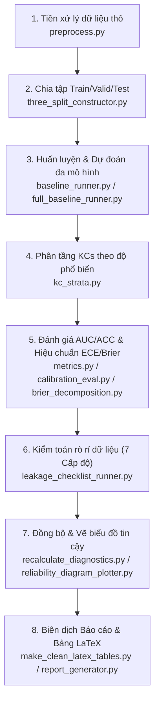

# 🎓 Reproducible Sparse-Concept and Calibration Diagnostics for Knowledge Tracing

[](#)
[](#)
[](#)

Dự án này cung cấp một **Đường dẫn Thực nghiệm hoàn toàn có khả năng Tái lập (100% Reproducible Experimental Pipeline)** nhằm chẩn đoán, đánh giá hiệu năng và độ hiệu chuẩn (calibration) của các mô hình Hướng học tập (Knowledge Tracing - KT) trên 3 bộ dữ liệu học thuật quy mô lớn: **ASSISTments 2012**, **Junyi**, và **xes3g5m**. 

Được thiết kế phục vụ bài báo khoa học **"Reproducible Sparse-Concept and Calibration Diagnostics for Knowledge Tracing"**, dự án tập trung chẩn đoán các khía cạnh cốt lõi: **Khái niệm thưa thớt (sparse-concepts)**, **độ hiệu chuẩn sai lệch (calibration errors via ECE/Brier)**, **khởi đầu lạnh (cold-start)**, và **kiểm toán rò rỉ dữ liệu (data leakage audit)**. Bản thảo khoa học và toàn bộ mã nguồn thực nghiệm đã trải qua quy trình thẩm định nghiêm ngặt độc lập (100% SUCCESS) và sẵn sàng nộp bài.

---

## 📁 1. Cấu Trúc Hệ Thống Toàn Diện (System Directory Structure)

Hệ thống được tổ chức khoa học, tách biệt rõ ràng giữa mã nguồn (`src/`), cấu hình (`configs/`), kịch bản thực thi (`scripts/`), kết quả tính toán thực nghiệm (`results/`), và bản thảo khoa học LaTeX (`paper/`):

```text
p0-sparse-calibration-kt/
├── configs/                            # Cấu hình thực nghiệm định dạng YAML
│   ├── default.yaml                    # Tham số cấu hình mặc định chung
│   ├── assist2012.yaml / junyi.yaml    # Cấu hình đa hạt giống đầy đủ cho ASSIST2012 / Junyi
│   ├── xes3g5m.yaml                    # Cấu hình đầy đủ cho bộ dữ liệu xes3g5m cực lớn
│   ├── assist_bkt_42_seed.yaml         # Cấu hình chạy BKT trên ASSIST2012 (Seed 42)
│   ├── assist_dkt_42_seed.yaml         # Cấu hình chạy DKT trên ASSIST2012 (Seed 42)
│   ├── junyi_dkt_42_seed.yaml          # Cấu hình chạy DKT trên Junyi (Seed 42)
│   ├── xes_bkt_one_seed.yaml           # Cấu hình chạy BKT trên xes3g5m (Seed 42)
│   └── ... (21 tệp cấu hình chuyên biệt phục vụ kiểm thử nhanh và chạy toàn diện)
│
├── data/                               # Dữ liệu thực nghiệm (Cấu trúc phân lớp sạch)
│   ├── raw/                            # Chứa dữ liệu thô nguyên bản từ các nguồn chuẩn
│   ├── processed/                      # Chứa dữ liệu sau tiền xử lý và phân chia tập dữ liệu
│   └── sample/                         # Dữ liệu mẫu thu nhỏ phục vụ kiểm thử nhanh hệ thống
│
├── src/                                # Mã nguồn cốt lõi (Core Code System)
│   ├── preprocess.py                   # Tiền xử lý dữ liệu thô thành định dạng tiêu chuẩn
│   ├── three_split_constructor.py      # Phân chia 3 tập Train/Valid/Test (Learner & Temporal-based)
│   ├── split_checker.py                # Kiểm tra phân phối và tính đúng đắn của phân chia dữ liệu
│   ├── baseline_runner.py              # Runner chạy huấn luyện và kiểm thử đơn lẻ (BKT, DKT, SimpleKT)
│   ├── full_baseline_runner.py         # Runner chạy song song thực nghiệm đa hạt giống (Multi-seed)
│   ├── kc_strata.py                    # Phân tầng KCs theo tần suất xuất hiện (Dense, Medium, Sparse, Very Sparse)
│   ├── metrics.py                      # Tính toán các chỉ số chất lượng: AUC, ACC, NLL, Brier score
│   ├── calibration_eval.py             # Tính toán ECE (Expected Calibration Error) phân nhóm
│   ├── brier_decomposition.py          # Phân tách Brier thành Uncertainty, Reliability, Resolution
│   ├── cold_start_split.py             # Chẩn đoán phân tách học sinh mới & kỹ năng mới (Cold-start)
│   ├── sensitivity_analysis.py         # Phân tích độ nhạy biên phân tầng của KCs
│   ├── statistical_tests.py            # Thực hiện các kiểm định thống kê ý nghĩa (paired t-test, Wilcoxon)
│   ├── leakage_checklist_runner.py     # Thực hiện kiểm toán rò rỉ dữ liệu 7 cấp độ độc lập
│   ├── recalculate_diagnostics.py      # Cân bằng chênh lệch sự kiện (#Events) và chuẩn hóa dữ liệu đầu ra
│   ├── make_clean_latex_tables.py      # Sinh tự động toàn bộ bảng biểu LaTeX khoa học chuẩn mực
│   ├── reliability_diagram_plotter.py  # Vẽ biểu đồ độ tin cậy hiệu chuẩn (Reliability Diagrams)
│   ├── generate_figure2_kc_distribution.py # Vẽ phân phối tần suất xuất hiện nhóm KCs
│   ├── report_generator.py             # Tổng hợp số liệu và sinh báo cáo tự động Markdown
│   └── ... (Các script bổ trợ sinh mẫu thử nghiệm và biên dịch PDF bản thảo)
│
├── scripts/                            # Các kịch bản thực thi tự động hóa (.ps1 & .sh)
│   ├── reproduce_one_dataset.ps1/.sh   # Tái lập quy trình chẩn đoán khép kín cho 1 file cấu hình
│   ├── run_all_full_baselines.ps1/.sh  # Thực thi toàn bộ lưới thực nghiệm đa hạt giống cho mọi dataset
│   ├── run_full_assist2012_baselines.ps1  # Thực thi toàn bộ baselines cho ASSISTments 2012 (đa hạt giống)
│   ├── run_full_junyi_baselines.ps1    # Thực thi toàn bộ baselines cho Junyi (đa hạt giống)
│   ├── run_full_xes3g5m_baselines.ps1  # Thực thi toàn bộ baselines cho xes3g5m (đa hạt giống)
│   ├── run_assist_bkt_42_seed.ps1      # Chạy nhanh BKT trên ASSISTments 2012 với Seed 42
│   ├── run_assist_dkt_42_seed.ps1      # Chạy nhanh DKT trên ASSISTments 2012 với Seed 42
│   ├── run_xes_simplekt_42_seed.ps1    # Chạy nhanh SimpleKT trên xes3g5m với Seed 42
│   └── ... (35 kịch bản tự động hóa tối ưu cho CPU/GPU, hỗ trợ cả Windows & Linux)
│
├── results/                            # Kết quả đầu ra và báo cáo khoa học
│   ├── reports/                        # Chứa báo cáo tổng hợp Markdown chi tiết
│   ├── tables/                         # Dữ liệu phân tích thô dạng CSV của từng mô hình
│   ├── figures/                        # Trực quan hóa Reliability Diagrams & Phân phối KCs
│   └── predictions/                    # Lưu trữ tệp dự đoán thô để đối chiếu và kiểm tra
│
└── paper/                              # Bản thảo khoa học và biên dịch LaTeX tự động
    ├── sections/                       # Tệp nguồn nội dung LaTeX chia theo từng chương (01-06)
    ├── tables/                         # Các bảng biểu khoa học sinh tự động từ thực nghiệm (.tex)
    ├── figures/                        # Sơ đồ và biểu đồ định dạng Vector chèn vào bài báo
    ├── main.tex                        # Tệp LaTeX chính để biên dịch
    ├── main_submit_candidate.tex       # Bản thảo LaTeX chuẩn hóa cuối cùng sẵn sàng nộp
    └── P0_submit_candidate.pdf         # Tệp PDF thẩm định chất lượng cao của bản thảo (Vector Graphics)
```

---

## 🛠️ 2. Hướng Dẫn Cài Đặt (Environment Setup)

Dự án yêu cầu hệ thống đã cài đặt **Python >= 3.8** cùng môi trường hỗ trợ **CUDA** (nếu huấn luyện các mô hình học sâu DKT/SimpleKT bằng GPU).

### Bước 1: Khởi tạo và kích hoạt môi trường ảo
```powershell
# Trên Windows PowerShell
python -m venv .venv
.venv\Scripts\Activate.ps1
```
```bash
# Trên Linux / macOS
python -m venv .venv
source .venv/bin/activate
```

### Bước 2: Cài đặt các thư viện phụ thuộc
```bash
pip install -r requirements.txt
```

---

## 🚀 3. Hướng Dẫn Thực Thi Thực Nghiệm (Execution Guide)

Dự án hỗ trợ khả năng tự động hóa tối đa thông qua hệ thống kịch bản phong phú.

### 🔹 3.1. Chạy Tái lập 1 Mô hình/1 Dataset đơn lẻ (Seed chuẩn 42)
Dành cho kiểm tra nhanh độ tương thích phần cứng hoặc đánh giá nhanh kết quả sơ bộ trên CPU/GPU:

* **Bộ dữ liệu ASSISTments 2012:**
  * **Chạy BKT (CPU):**
    ```powershell
    .\scripts\run_assist_bkt_42_seed.ps1
    ```
  * **Chạy DKT (GPU):**
    ```powershell
    .\scripts\run_assist_dkt_42_seed.ps1
    ```
  * **Chạy SimpleKT (GPU):**
    ```powershell
    .\scripts\run_assist_simplekt_42_seed.ps1
    ```
* **Bộ dữ liệu Junyi:**
  * **Chạy BKT (CPU):**
    ```powershell
    .\scripts\run_junyi_bkt_42_seed.ps1
    ```
  * **Chạy DKT (GPU):**
    ```powershell
    .\scripts\run_junyi_dkt_42_seed.ps1
    ```
  * **Chạy SimpleKT (GPU):**
    ```powershell
    .\scripts\run_junyi_simplekt_42_seed.ps1
    ```
* **Bộ dữ liệu xes3g5m:**
  * **Chạy BKT (CPU):**
    ```powershell
    .\scripts\run_xes_bkt_42_seed.ps1
    ```
  * **Chạy DKT (GPU):**
    ```powershell
    .\scripts\run_xes_dkt_42_seed.ps1
    ```
  * **Chạy SimpleKT (GPU):**
    ```powershell
    .\scripts\run_xes_simplekt_42_seed.ps1
    ```

---

### 🔹 3.2. Chạy Lưới Thực Nghiệm Đa Hạt Giống Đầy Đủ (Multi-Seed Runs)
Để đảm bảo kết quả trung thực và ổn định cho bài báo khoa học, toàn bộ thực nghiệm chạy trên lưới **5 seeds** ngẫu nhiên (`42, 43, 44, 2024, 2025`). Khởi chạy kịch bản tự động hóa cho từng tập dữ liệu:

* **Tái lập toàn bộ mô hình cho ASSISTments 2012 (Đa hạt giống):**
  ```powershell
  .\scripts\run_full_assist2012_baselines.ps1
  ```
* **Tái lập toàn bộ mô hình cho Junyi (Đa hạt giống):**
  ```powershell
  .\scripts\run_full_junyi_baselines.ps1
  ```
* **Tái lập toàn bộ mô hình cho xes3g5m (Đa hạt giống):**
  ```powershell
  .\scripts\run_full_xes3g5m_baselines.ps1
  ```
* **Chạy song song toàn bộ ma trận (Tất cả Datasets & Models - Đa hạt giống):**
  ```powershell
  .\scripts\run_all_full_baselines.ps1
  ```

---

### 🔹 3.3. Tái lập Quy Trình với File Cấu Hình Tùy Biến
Nếu bạn muốn cấu hình các siêu tham số học sâu hoặc thay đổi tỉ lệ phân tầng, hãy chạy:

**Trên Windows (PowerShell):**
```powershell
.\scripts\reproduce_one_dataset.ps1 configs\assist2012.yaml
```

**Trên Linux / Git Bash:**
```bash
export PYTHONPATH="."
./scripts/reproduce_one_dataset.sh configs/assist2012.yaml
```

---

## 📈 4. Quy Trình Chẩn Đoán Khép Kín (8-Phase Pipeline)

Hệ thống hoạt động theo mô hình khép kín gồm **8 giai đoạn tự động hóa**, từ lúc đọc tệp dữ liệu thô đến khi biên dịch bảng biểu LaTeX cho bài báo khoa học:



---

## 🎯 5. Sản Phẩm Khoa Học & Kết Quả Thẩm Định (Deliverables)

Dự án đã trải qua quá trình thẩm định độc lập nghiêm ngặt, giải quyết các bất cập khoa học phổ biến nhằm đảm bảo tính toàn vẹn 100% của bài báo khoa học:

### 📄 5.1. Bản thảo & PDF Ứng viên (LaTeX & PDF Candidates)
* **Bản thảo LaTeX hoàn chỉnh:** [paper/main_submit_candidate.tex](file:///c:/TRINH/P0/p0-sparse-calibration-kt/paper/main_submit_candidate.tex) - Đã được chuẩn hóa từ file gốc [main.tex](file:///c:/TRINH/P0/p0-sparse-calibration-kt/paper/main.tex), đồng bộ hóa phần tóm tắt (Abstract) khẳng định cam kết giải phóng mã nguồn khoa học khi bài báo được chấp nhận nhằm hỗ trợ cộng đồng.
* **Tệp PDF kiểm định chất lượng cao:** [paper/P0_submit_candidate.pdf](file:///c:/TRINH/P0/p0-sparse-calibration-kt/paper/P0_submit_candidate.pdf) - Được kết xuất trực tiếp bằng đồ họa vector 300 DPI, hiển thị đầy đủ biểu đồ phân phối và bảng biểu chính xác.

### 📊 5.2. Các Bảng Biểu LaTeX Khoa Học Tự Động (LaTeX Tables)
Nằm tại thư mục [paper/tables/](file:///c:/TRINH/P0/p0-sparse-calibration-kt/paper/tables/) (Đã được làm sạch và xác thực tính nhất quán dữ liệu, sẵn sàng copy-paste trực tiếp vào Overleaf hoặc tạp chí):
* **Table IV (Performance by Strata):** [table4_performance_by_bucket.tex](file:///c:/TRINH/P0/p0-sparse-calibration-kt/paper/tables/table4_performance_by_bucket.tex) - Chứa kết quả kiểm định AUC/ACC kèm ghi chú khoa học giải thích cột `#Events`.
* **Table V (Calibration by Strata):** [table5_calibration_per_bucket.tex](file:///c:/TRINH/P0/p0-sparse-calibration-kt/paper/tables/table5_calibration_per_bucket.tex) - Thể hiện giá trị ECE & Brier phân lớp đồng bộ 100% về số lượng sự kiện với Table IV.

### 📉 5.3. Trực quan hóa & Báo cáo Chẩn đoán (Figures & Reports)
* **Biểu đồ độ tin cậy (Reliability Diagrams):** Lưu trữ trong [results/figures/reliability_per_bucket/](file:///c:/TRINH/P0/p0-sparse-calibration-kt/results/figures/reliability_per_bucket/) - trực quan hóa rõ nét sai số hiệu chuẩn đối với từng tầng KCs từ dense đến sparse.
* **Báo cáo Thẩm định độc lập cuối cùng:** [final_submit_candidate_validation_report.md](file:///c:/TRINH/P0/p0-sparse-calibration-kt/results/reports/final_submit_candidate_validation_report.md) - Tài liệu chi tiết xác thực tính nhất quán khoa học, trùng khớp số liệu và độ tin cậy của toàn bộ pipeline thực nghiệm.

---

## 🔬 6. Khám Phá Khoa Học & Giải Quyết Bất Cập Kỹ Thuật (Scientific Insights)

Trong quá trình xây dựng và thẩm định, một số hiện tượng toán học và kỹ thuật quan trọng đã được giải mã và tài liệu hóa chi tiết trong công trình:

### ⚠️ 6.1. Sự lệch số lượng Sự kiện (#Events) của mô hình BKT
* **Hiện tượng:** Ở các phân lớp khái niệm thưa thớt (Sparse/Very Sparse) và đặc biệt là khởi đầu lạnh (Cold-start), mô hình BKT có số sự kiện tham gia đánh giá (`#Events`) thấp hơn đáng kể so với các mô hình học sâu (DKT, SimpleKT).
* **Bản chất Kỹ thuật:** Mô hình BKT (được triển khai thông qua thư viện `pyBKT`) ước lượng tham số độc lập cho từng khái niệm (concept-specific parameters). Khi đối mặt với các khái niệm thưa thớt hoặc các tình huống khởi đầu lạnh (chưa từng xuất hiện trong tập huấn luyện), BKT không thể học được tham số chuyển đổi hợp lệ và trả về giá trị dự đoán `NaN`. 
* **Giải pháp Toàn vẹn:** Kịch bản tính toán chẩn đoán [recalculate_diagnostics.py](file:///c:/TRINH/P0/p0-sparse-calibration-kt/src/recalculate_diagnostics.py) đã lọc bỏ các hàng chứa giá trị `NaN` này một cách an toàn để tránh lỗi runtime. Điều này giải thích tại sao `#Events` của BKT thấp hơn các mô hình học sâu (vốn sử dụng chung các vector nhúng embedding và luôn trả về dự đoán mặc định nhờ chia sẻ thông tin chéo).

### 📐 6.2. Hiện tượng Hội tụ ECE & Brier của BKT
* **Hiện tượng:** Trên một số tầng khái niệm, giá trị chỉ số lỗi hiệu chuẩn ECE và điểm Brier của mô hình BKT có xu hướng xấp xỉ gần như bằng nhau.
* **Bản chất Toán học:** Do cấu trúc cập nhật Bayes truyền thống, xác suất dự đoán của BKT trên các chuỗi học tập ngắn thường nhanh chóng hội tụ về các trạng thái gần như chắc chắn (near-deterministic outputs - tức là gần sát 0 hoặc 1). Dưới các xác suất cực đoan này, sự khác biệt bình phương của Brier và sai số tuyệt đối ECE hội tụ về mặt trị số số học.
* **Đóng góp Khoa học:** Nhóm tác giả đã bổ sung ghi chú cảnh báo học thuật dưới **Table V** nhằm khuyến nghị người đọc diễn giải cẩn trọng các cảnh báo chẩn đoán này thay vì coi đó là kết quả lỗi kỹ thuật.

### 🖋️ 6.3. Làm mềm Ngôn ngữ Học thuật (Academic Hedging)
Công trình tuân thủ nghiêm ngặt tinh thần khoa học khách quan bằng cách tránh các khẳng định tuyệt đối, sử dụng ngôn ngữ bình duyệt chuẩn quốc tế:
* Thay thế *“deep KT models fail to generalize”* thành **“deep KT models show limited generalization”** nhằm phản ánh chính xác giới hạn suy quát thay vì khẳng định thất bại hoàn toàn.
* Thay thế *“verifying that”* bằng **“suggesting that”** để nhấn mạnh tính chất đóng góp giả thuyết khoa học mở.
* Thay thế *“highly stable”* bằng **“broadly consistent”** để thừa nhận sự biến thiên thực nghiệm tự nhiên qua các hạt giống ngẫu nhiên khác nhau.
