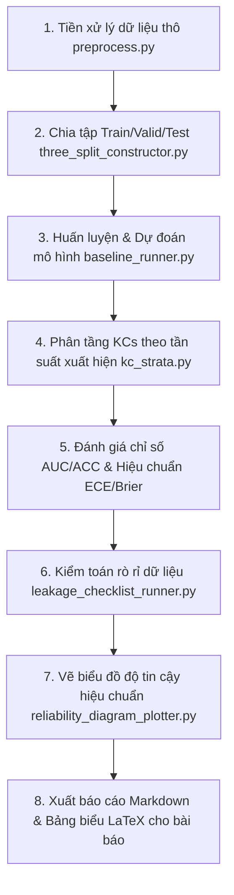

# Reproducible Sparse-Concept and Calibration Diagnostics for Knowledge Tracing

Dự án này cung cấp một đường dẫn thực nghiệm hoàn toàn có khả năng tái lặp (Reproducible Experimental Pipeline) nhằm chẩn đoán và đánh giá hiệu năng của các mô hình Hướng học tập (Knowledge Tracing - KT) dưới các khía cạnh: khái niệm thưa thớt (sparse-concept), độ hiệu chuẩn (calibration), khởi đầu lạnh (cold-start), và kiểm toán rò rỉ dữ liệu (leakage-audit).

---

## 📁 1. Cấu Trúc Thư Mục Dự Án (Project Structure)

```text
p0-sparse-calibration-kt/
├── configs/                       # Thư mục chứa các tệp cấu hình YAML
│   ├── default.yaml               # Cấu hình mặc định
│   ├── assist2012.yaml            # Cấu hình đầy đủ cho ASSISTments 2012
│   ├── junyi.yaml                 # Cấu hình đầy đủ cho Junyi
│   ├── xes3g5m.yaml               # Cấu hình đầy đủ cho xes3g5m
│   ├── assist_dkt_42_seed.yaml    # Cấu hình chạy DKT trên ASSIST2012 (1 seed 42)
│   ├── junyi_dkt_42_seed.yaml     # Cấu hình chạy DKT trên Junyi (1 seed 42)
│   ├── junyi_simplekt_42_seed.yaml# Cấu hình chạy SimpleKT trên Junyi (1 seed 42)
│   ├── xes_bkt_42_seed.yaml       # Cấu hình chạy BKT trên xes3g5m (1 seed 42)
│   ├── xes_dkt_42_seed.yaml       # Cấu hình chạy DKT trên xes3g5m (1 seed 42)
│   └── xes_simplekt_42_seed.yaml  # Cấu hình chạy SimpleKT trên xes3g5m (1 seed 42)
│
├── data/                          # Dữ liệu thực nghiệm (Đã được cấu hình cấu trúc sạch bằng .gitkeep)
│   ├── raw/                       # Chứa tệp dữ liệu thô tải từ các nguồn chuẩn
│   ├── processed/                 # Chứa dữ liệu sau khi tiền xử lý và chia tập Train/Valid/Test
│   └── sample/                    # Chứa các mẫu dữ liệu nhỏ phục vụ kiểm thử nhanh
│
├── src/                           # Mã nguồn cốt lõi (Core Code)
│   ├── preprocess.py              # Tiền xử lý dữ liệu thô cho từng tập dữ liệu
│   ├── three_split_constructor.py # Chia dữ liệu 3 tập (Train/Valid/Test) theo Learner-based & Temporal
│   ├── baseline_runner.py         # Huấn luyện và dự đoán các mô hình BKT, DKT, SimpleKT
│   ├── kc_strata.py               # Phân tầng KCs theo độ phổ biến (Dense, Medium, Sparse, Very Sparse)
│   ├── metrics.py                 # Tính toán các chỉ số AUC, ACC, NLL, Brier score
│   ├── calibration_eval.py        # Tính toán chỉ số hiệu chuẩn ECE (Expected Calibration Error)
│   ├── brier_decomposition.py     # Phân tích thành phần Brier (Uncertainty, Reliability, Resolution)
│   ├── cold_start_split.py        # Đánh giá khả năng chẩn đoán đối với người học mới (Cold-start)
│   ├── sensitivity_analysis.py    # Phân tích độ nhạy của ngưỡng phân tầng KCs
│   ├── leakage_checklist_runner.py# Kiểm toán rò rỉ dữ liệu (Leakage Audit Checkpoints)
│   ├── reliability_diagram_plotter.py # Vẽ biểu đồ độ tin cậy hiệu chuẩn (Reliability Diagrams)
│   └── report_generator.py        # Tự động xuất báo cáo khoa học Markdown
│
├── scripts/                       # Các kịch bản thực thi tự động (.ps1 cho Windows, .sh cho Linux/Bash)
│   ├── reproduce_one_dataset.ps1  # Khởi chạy toàn bộ quy trình chẩn đoán cho 1 tệp cấu hình
│   ├── run_junyi_dkt_42_seed.ps1   # Chạy DKT trên Junyi với duy nhất seed 42
│   ├── run_junyi_simplekt_42_seed.ps1 # Chạy SimpleKT trên Junyi với duy nhất seed 42
│   ├── run_assist_dkt_42_seed.ps1 # Chạy DKT trên ASSIST2012 với duy nhất seed 42
│   ├── run_xes_bkt_42_seed.ps1    # Chạy BKT trên xes3g5m với duy nhất seed 42
│   ├── run_xes_dkt_42_seed.ps1    # Chạy DKT trên xes3g5m với duy nhất seed 42
│   └── run_xes_simplekt_42_seed.ps1 # Chạy SimpleKT trên xes3g5m với duy nhất seed 42
│
├── results/                       # Báo cáo và Kết quả đầu ra
│   ├── reports/                   # Chứa báo cáo tổng hợp Markdown (p0_diagnostic_report.md)
│   ├── tables/                    # Kết quả phân tích chi tiết định dạng CSV
│   └── figures/                   # Biểu đồ phân phối KCs và biểu đồ tin cậy hiệu chuẩn (Reliability Diagrams)
│
├── paper/                         # Các thành phần bài báo khoa học hỗ trợ LaTeX
│   ├── sections/                  # Nội dung các chương bài báo LaTeX
│   ├── tables/                    # Các bảng biểu khoa học biên dịch tự động sang mã LaTeX (.tex)
│   └── main.tex                   # File biên dịch chính của bài báo LaTeX
│
└── requirements.txt               # Các thư viện phụ thuộc của dự án
```

---

## 🛠️ 2. Hướng Dẫn Cài Đặt (Getting Started)

### Bước 1: Chuẩn bị môi trường
Yêu cầu hệ thống đã cài đặt **Python >= 3.8** cùng môi trường hỗ trợ **CUDA** (nếu muốn tăng tốc độ huấn luyện học sâu DKT/SimpleKT bằng GPU).

Khởi tạo môi trường ảo và kích hoạt:
```powershell
# Trên Windows PowerShell
python -m venv .venv
.venv\Scripts\Activate.ps1
```

### Bước 2: Cài đặt các thư viện phụ thuộc
```powershell
pip install -r requirements.txt
```

---

## 🚀 3. Hướng Dẫn Thực Thi Dự Án (How to Run)

Dự án hỗ trợ cả môi trường **PowerShell** (Windows) và **Bash** (Git Bash, Linux, macOS).

### 🔹 Phương án 1: Chạy mô hình trên GPU cho 1 Seed (Khuyên dùng khi cần tái lập nhanh)

Tôi đã xây dựng các kịch bản chạy chuyên biệt cho từng mô hình và tập dữ liệu trên GPU với duy nhất **1 seed chuẩn 42**:

#### 1. Bộ dữ liệu ASSISTments 2012 (111MB):
* **Chạy DKT (GPU):**
  ```powershell
  .\scripts\run_assist_dkt_42_seed.ps1
  ```
* **Chạy SimpleKT (GPU):**
  ```powershell
  .\scripts\run_assist_simplekt_42_seed.ps1
  ```

#### 2. Bộ dữ liệu Junyi (3.0 GB):
* **Chạy DKT (GPU):**
  ```powershell
  .\scripts\run_junyi_dkt_42_seed.ps1
  ```
* **Chạy SimpleKT (GPU):**
  ```powershell
  .\scripts\run_junyi_simplekt_42_seed.ps1
  ```
* **Chạy BKT (CPU):**
  ```powershell
  .\scripts\run_junyi_bkt_42_seed.ps1
  ```

#### 3. Bộ dữ liệu xes3g5m (7.9 triệu dòng):
* **Chạy BKT (CPU):**
  ```powershell
  .\scripts\run_xes_bkt_42_seed.ps1
  ```
* **Chạy DKT (GPU):**
  ```powershell
  .\scripts\run_xes_dkt_42_seed.ps1
  ```
* **Chạy SimpleKT (GPU):**
  ```powershell
  .\scripts\run_xes_simplekt_42_seed.ps1
  ```

---

### 🔹 Phương án 2: Chạy tái lập toàn bộ quy trình cho 1 tập dữ liệu cấu hình tùy biến

Bạn có thể chạy tái lập toàn bộ quy trình tiền xử lý, huấn luyện đa mô hình (BKT, DKT, SimpleKT) và xuất bản báo cáo cho bất kỳ tệp cấu hình `.yaml` nào bằng lệnh:

**Dành cho PowerShell (Windows):**
```powershell
.\scripts\reproduce_one_dataset.ps1 configs\assist2012.yaml
```

**Dành cho Bash (Linux/Git Bash):**
```bash
export PYTHONPATH="."
./scripts/reproduce_one_dataset.sh configs/assist2012.yaml
```

---

## 📈 4. Quy Trình Chạy Chi Tiết Của Kịch Bản (Pipeline Flow)

Mỗi khi khởi chạy kịch bản chẩn đoán, dự án sẽ tự động đi qua **8 giai đoạn khép kín**:



---

## 📝 5. Kết Quả Đầu Ra (Key Outputs)

Sau khi quy trình hoàn tất, các kết quả khoa học sẽ được xuất ra tại các vị trí:
1. 📄 **Báo cáo chẩn đoán Markdown**: [p0_diagnostic_report.md](file:///c:/TRINH/P0/p0-sparse-calibration-kt/results/reports/p0_diagnostic_report.md) - Chứa diễn giải chi tiết, số liệu trực quan hóa hiệu năng của toàn bộ thực nghiệm.
2. 📊 **Bảng biểu LaTeX khoa học**: Nằm tại thư mục [paper/tables/](file:///c:/TRINH/P0/p0-sparse-calibration-kt/paper/tables/) (Sẵn sàng sao chép trực tiếp vào mã nguồn của bài báo khoa học).
3. 📉 **Biểu đồ độ tin cậy**: Lưu tại [results/figures/reliability_per_bucket/](file:///c:/TRINH/P0/p0-sparse-calibration-kt/results/figures/reliability_per_bucket/) giúp trực quan trực tiếp lỗi hiệu chuẩn của các mô hình KT đối với từng lớp khái niệm từ dày đặc tới thưa thớt.
